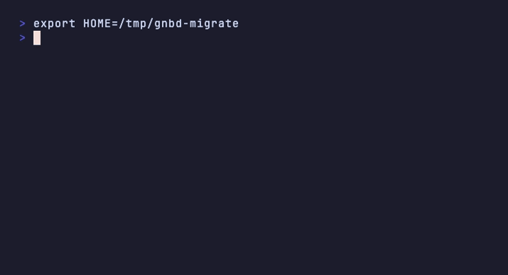
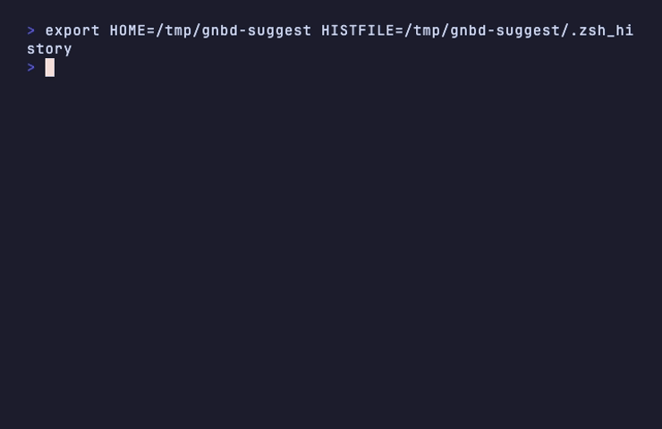
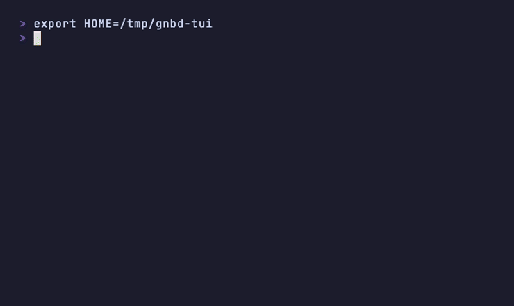

# ganbatte

> for lazy developers | 頑張って !

워크플로우/단축어 관리 CLI. 단순 alias 관리를 넘어 **셸 alias 자동 마이그레이션, 히스토리 패턴 발굴, 파라미터 alias, 위험 명령 가드레일, 프로젝트 온보딩**까지 하나의 바이너리로.

### `gnb migrate` — 기존 alias 원클릭 가져오기



### `gnb suggest` — 히스토리에서 alias 자동 추천



### `gnb` — TUI 브라우저



---

## Why ganbatte?

### vs shell alias

| | shell alias | ganbatte |
|---|---|---|
| 등록 | `.zshrc` 직접 편집 | `gnb add gs "git status"` |
| 사용 | `gs` | `gs` (`eval "$(gnb shell-init)"` 이후 동일) |
| 파라미터 | function 작성 필요, 셸마다 문법 다름 | `cmd = "git checkout {branch}"` 선언 한 줄 |
| 위험 명령 보호 | 없음 | `confirm = true` 한 줄로 실행 전 확인 |
| 다른 머신 이동 | dotfiles 복사 | `gnb export` / `gnb import` |
| 뭐 등록했는지 확인 | `alias` 치고 눈으로 스캔 | TUI fuzzy search + 미리보기 |
| 히스토리 분석 | `sort \| uniq -c` 직접 | `gnb suggest --apply` 원클릭 |
| 기존 alias 가져오기 | N/A | `gnb migrate` 원커맨드 |

### vs just / task / make

| | just/task/make | ganbatte |
|---|---|---|
| 용도 | 프로젝트 빌드/태스크 러너 | 개인 alias + 프로젝트 워크플로우 |
| 발견성 | `just --list` (텍스트) | TUI fuzzy search + 미리보기 |
| 개인 alias | 불가 (프로젝트 전용) | 글로벌 + 프로젝트 스코프 공존 |
| 히스토리 마이닝 | 없음 | `gnb suggest` |
| 크로스 셸 | 셸 의존적 | bash/zsh/fish 동일 설정 |

**한 문장으로**: alias가 많아질수록, 머신이 늘어날수록, 팀이 커질수록 ganbatte의 가치가 올라간다.

---

## Install

```bash
# Homebrew Cask (macOS)
brew install --cask bssm-oss/tap/ganbatte

# Go install (macOS / Linux)
go install github.com/justn-hyeok/ganbatte@latest

# 로컬 빌드
git clone https://github.com/justn-hyeok/ganbatte.git
cd ganbatte
go build -o gnb .
```

---

## Quick Start

### 기존 alias가 있을 때 (가장 빠른 경로)

```bash
# 1. .zshrc / .bashrc / config.fish의 alias를 한 번에 가져오기
gnb migrate

# 2. 셸에 ganbatte 훅 등록
echo 'eval "$(gnb shell-init)"' >> ~/.zshrc
source ~/.zshrc

# 3. 기존 alias가 그대로 작동
gs           # git status -sb
ll           # eza -alF --git
dc up -d     # docker compose up -d
```

### 처음부터 시작할 때

```bash
gnb init                           # 설정 초기화 (포맷 선택, 예시 생성)
gnb add gs "git status -sb"        # alias 추가
echo 'eval "$(gnb shell-init)"' >> ~/.zshrc
source ~/.zshrc
gs                                 # 즉시 사용
```

---

## Features

### 1. Killer Feature: `gnb migrate`

기존 셸에 흩어진 alias를 원커맨드로 가져온다.

```
$ gnb migrate
Found 17 aliases in /Users/you/.zshrc
Found 8 aliases in /Users/you/.bash_aliases

25 new alias(es) to import:
  gs = "git status -sb"
  ll = "eza -alF --git"
  dc = "docker compose"
  ...

Import all? [Y/n] y
✓ 25 alias(es) imported
Run 'eval "$(gnb shell-init)"' to activate them
```

```bash
gnb migrate                # 현재 셸 자동 감지, 대화형 임포트
gnb migrate --shell zsh    # 특정 셸 지정
gnb migrate --dry-run      # 변경 없이 미리보기만
```

이미 등록된 항목은 자동으로 건너뛴다. 같은 이름인데 내용이 다르면 별도 경고를 표시한다.

---

### 2. Shell Integration

```bash
# .zshrc / .bashrc에 추가
eval "$(gnb shell-init)"

# fish
gnb shell-init | source
```

이 한 줄을 추가하면 등록된 모든 alias/workflow가 네이티브 셸 명령으로 동작한다. 내부적으로 각 항목마다 셸 함수를 생성한다.

```bash
# gnb shell-init 출력 예시
gs() { gnb run gs "$@"; }
gl() { gnb run gl "$@"; }
deploy() { gnb run deploy "$@"; }
```

지원 셸: **bash**, **zsh**, **fish**. 각 셸의 함수 문법에 맞게 자동 분기된다.

**유효하지 않은 함수 이름** (숫자로 시작, 공백 포함 등)은 자동으로 건너뛰고 주석으로 표시한다:

```bash
# skipped '123bad': invalid function name
# skipped 'has space': invalid function name
```

---

### 3. Passive Tracking (히스토리 수집)

`gnb shell-init`을 셸에 등록하면 커맨드 실행 시 자동으로 `~/.local/share/ganbatte/track.log`에 기록된다. **gnb 바이너리를 스폰하지 않고** 셸 built-in으로 직접 파일에 append하기 때문에 레이턴시가 없다.

```
# track.log 형식 (unix_ts \t exit_code \t command)
1745000000	0	git clone https://github.com/user/repo.git
1745000060	0	npm run build
1745000120	1	npm run test
```

50개 이상 쌓이면 `gnb suggest`가 셸 히스토리 대신 이 로그를 우선 사용한다. 실행 결과(exit code)를 알고 있기 때문에 더 정확한 분석이 가능하다.

로그가 10MB를 넘으면 `track.log.1`로 자동 로테이션된다.

| 셸 | 수집 방식 |
|---|---|
| zsh | `preexec_functions` + `precmd_functions` |
| bash | `trap DEBUG` + `PROMPT_COMMAND` |
| fish | `--on-event fish_postexec` |

---

### 4. `gnb suggest` — 히스토리 마이닝

셸 히스토리(또는 track.log)를 분석해 alias와 workflow를 추천한다.

```
$ gnb suggest
Analyzing ganbatte track log (/Users/you/.local/share/ganbatte/track.log) (312 entries)...

=== Alias Suggestions ===
  1. c            = claude
     Used 5 times · saves ~25 keystrokes

=== Parameterized Alias Suggestions ===
  1. gcl(repo) → git clone {repo}
     Pattern 'git clone <...>' used 25 times with 25 variants
  2. rr(path) → rm -rf {path}
     Pattern 'rm -rf <...>' used 11 times with 11 variants
  3. nig(package) → npm i -g {package}
     Pattern 'npm i -g <...>' used 5 times with 5 variants

=== Workflow Suggestions ===
  1. git-add
     Step 1: git add .
     Step 2: git commit -m "update"
     Step 3: git push
     Sequence appeared 7 times

Applying all suggestions would save ~89 keystrokes based on your history.
```

```bash
gnb suggest                     # 분석 + 추천 출력
gnb suggest --apply             # 추천 항목 설정에 자동 적용
gnb suggest --min-frequency 3   # alias 추천 최소 빈도 조정 (기본값 5)
gnb suggest --min-sequence 2    # workflow 추천 최소 등장 횟수 (기본값 3)
gnb suggest --from-history      # track.log 무시, 셸 히스토리 강제 사용
```

#### 추천 알고리즘 상세

**정렬 기준 — 키스트로크 절약량**

단순 빈도가 아니라 `(명령 길이 - 별칭 길이) × 빈도`로 정렬한다. 5번만 쳤어도 긴 명령이 10번 친 짧은 명령보다 높이 올 수 있다.

**파라미터 alias 감지**

같은 N-token 접두사를 공유하는 명령 그룹을 찾아 변하는 자리를 파라미터로 치환한다. 세 가지 품질 게이트를 통과해야 추천된다:

1. **서브커맨드 게이트**: 변하는 토큰 뒤에 다른 토큰이 계속 따라오면 (`git remote add`, `git remote remove`) 서브커맨드 위치이므로 제외
2. **인자 유사도 게이트**: 변하는 값의 절반 이상이 짧고 평범한 단어면 (서브커맨드처럼 생겼으면) 제외
3. **플래그 게이트**: 변하는 값의 절반 이상이 `-`로 시작하면 제외

파라미터 이름은 접두사에 따라 자동 결정된다: `git clone →  repo`, `npm run → script`, `rm -rf → path`, `docker run → image` 등 40여 개 패턴 내장.

**유니버설 별칭 충돌 방지**

`gc`, `gs`, `gl`, `gco`, `ll`, `k` 등 개발자 생태계에서 이미 광범위하게 쓰이는 20개 이름은 추천 대상에서 제외된다. 기존 alias와 충돌하지 않도록 더 긴 후보명(첫 글자 + 두 번째 단어 2~3글자)으로 자동 대체한다.

**노이즈 필터링**

4글자 미만, `#`으로 시작하는 주석, `\`로 끝나는 멀티라인 연속 명령, 특수문자만으로 구성된 항목은 자동 제외된다.

**파괴적 명령 자동 마킹**

`rm `, `kill `, `git reset`, `git clean`, `git push --force` 등의 prefix를 가진 명령은 `--apply` 시 자동으로 `confirm = true`가 설정된다.

---

### 5. Parameterized Aliases

셸 function 작성 없이 선언적으로 파라미터를 처리한다.

```toml
[alias.gco]
cmd = "git checkout {branch}"
params = ["branch"]

[alias.glog]
cmd = "git log --oneline -{count}"
params = ["count"]
default_params = { count = "10" }

[alias.gcl]
cmd = "git clone {repo}"
params = ["repo"]
```

```bash
gco feature/login      # → git checkout feature/login
glog                   # → git log --oneline -10 (기본값 사용)
glog 30                # → git log --oneline -30
gcl user/my-repo       # → git clone user/my-repo
```

파라미터가 여러 개인 경우 순서대로 치환된다:

```toml
[alias.docker-tag]
cmd = "docker tag {src} {dst}"
params = ["src", "dst"]
```

```bash
docker-tag myapp:latest registry.io/myapp:v1.0
# → docker tag myapp:latest registry.io/myapp:v1.0
```

---

### 6. Confirm Guard

파괴적 명령에 실행 전 확인 프롬프트를 붙인다.

```toml
[alias.nuke]
cmd = "git reset --hard HEAD"
confirm = true

[alias.clean-docker]
cmd = "docker system prune -af"
confirm = true
```

```
$ nuke
⚠ Run "git reset --hard HEAD"? [y/N]: y
Running: git reset --hard HEAD
HEAD is now at a3f2b1c ...
```

CI 환경에서는 `--yes` 플래그로 프롬프트를 건너뛸 수 있다:

```bash
gnb run nuke --yes
```

---

### 7. Workflow Engine

여러 명령을 시퀀스로 묶어 실행한다.

```toml
[workflow.deploy]
description = "Lint, test, build, push"
params = ["branch"]
steps = [
  { run = "pnpm lint" },
  { run = "pnpm test", on_fail = "stop" },
  { run = "pnpm build" },
  { run = "git push origin {branch}", confirm = true },
]
tags = ["deploy", "ci"]
```

```bash
deploy main            # gnb run deploy main
deploy main --dry-run  # 실행 없이 단계 미리보기
```

**`on_fail` 옵션**

| 값 | 동작 |
|---|---|
| `stop` | 실패 시 즉시 중단 (기본값) |
| `continue` | 실패 무시하고 다음 단계 진행 |
| `prompt` | 실패 시 continue / abort 사용자에게 질문 |

**dry-run**

```
$ deploy main --dry-run
[dry-run] Step 1/4: pnpm lint
[dry-run] Step 2/4: pnpm test
[dry-run] Step 3/4: pnpm build
[dry-run] Step 4/4: git push origin main
[DESTRUCTIVE] git push detected
[requires confirmation]
```

파괴적 명령(`git push --force`, `rm`, `docker system prune` 등)은 dry-run 출력에서 경고가 표시된다.

---

### 8. TUI Browser

`gnb`를 인자 없이 실행하면 fuzzy search + 미리보기 TUI 브라우저가 열린다.

```
┌─ ganbatte ─────────────────────────────────────────────────────────┐
│ > git                                                               │
├─────────────────────────┬───────────────────────────────────────────┤
│ [alias]  gs             │ git status -sb                            │
│ [alias]  gl             │ git log --oneline -10                     │
│ [alias]  gco            │ git checkout {branch}                     │
│ [project] deploy        │ Lint, test, build, push                   │
│           Step 1: pnpm lint                                         │
│           Step 2: pnpm test                                         │
│           Step 3: pnpm build                                        │
│           Step 4: git push origin {branch}  [confirm]               │
└─────────────────────────┴───────────────────────────────────────────┘
  ↑/k ↓/j  navigate   Enter  run   /  search   t  tag filter   ?  help
```

| 키 | 동작 |
|---|---|
| `↑`/`k`, `↓`/`j` | 항목 이동 |
| `Enter` | 선택한 항목 실행 |
| `/` | fuzzy 검색 |
| `e` | 설정 파일을 에디터로 열기 |
| `d` | 삭제 (확인 프롬프트) |
| `t` | 태그 필터 순환 |
| `?` | 도움말 패널 |
| `q` / `Esc` | 종료 |

글로벌 항목과 프로젝트 항목이 구분되어 표시된다. 프로젝트 항목은 `[project]` 레이블로 표시되며 목록 상단에 나온다.

---

### 9. Project Onboarding

`.ganbatte.toml`을 repo에 커밋하면 새 팀원이 클론 직후 즉시 생산적이다.

```bash
gnb init --project               # .ganbatte.toml 생성
```

```toml
# .ganbatte.toml (repo에 커밋)
[workflow.setup]
description = "프로젝트 초기 세팅"
steps = [
  { run = "npm install" },
  { run = "cp .env.example .env" },
  { run = "npm run db:migrate" },
]
tags = ["onboarding"]

[workflow.dev]
description = "개발 서버 시작"
steps = [
  { run = "docker compose up -d" },
  { run = "npm run dev" },
]
tags = ["dev"]
```

```bash
git clone <repo> && cd <repo>
gnb                              # TUI에서 [project] 워크플로우 탐색
gnb run setup                   # 원클릭 초기 세팅
```

---

### 10. Config Management

#### 포맷 선택

TOML, YAML, JSON을 동등하게 지원한다. `gnb init` 시 선택하거나, 언제든지 전환할 수 있다.

```bash
gnb config convert --to yaml     # TOML → YAML 변환
gnb config convert --to json     # TOML → JSON 변환
gnb config path                  # 현재 활성 설정 파일 경로 출력
```

**TOML (기본)**
```toml
[alias.gs]
cmd = "git status -sb"
```

**YAML**
```yaml
alias:
  gs:
    cmd: git status -sb
```

**JSON**
```json
{
  "alias": {
    "gs": { "cmd": "git status -sb" }
  }
}
```

세 포맷은 완전히 동등하게 처리된다.

#### 스코프

| 스코프 | 경로 | 특징 |
|---|---|---|
| Global | `~/.config/ganbatte/config.{toml,yaml,json}` | 어디서든 작동 |
| Project | `.ganbatte.{toml,yaml,json}` | 현재 디렉토리 또는 상위 디렉토리 자동 탐색, repo에 커밋 |

같은 이름이 두 스코프에 모두 있으면 project가 global을 override한다. `gnb list`는 두 스코프를 구분해서 표시한다.

#### Export / Import

설정을 파일로 백업하거나 다른 머신으로 옮길 수 있다.

```bash
gnb export -o backup.toml                  # 전체 설정 내보내기
gnb export --aliases-only -o aliases.toml  # alias만
gnb import backup.toml                     # 가져오기 (merge, 기존 항목 유지)
gnb import backup.toml --replace           # 가져오기 (기존 설정 교체)
```

---

## Commands

```
Setup
  gnb init                           글로벌 설정 초기화 (포맷 선택, 예시 생성)
  gnb init --project                 프로젝트 설정 초기화
  gnb init --format yaml             특정 포맷으로 초기화
  gnb doctor                         환경 진단 (설정 유효성, 셸 통합 상태)

Shell Integration
  gnb shell-init                     셸 함수 출력 (bash/zsh)
  gnb shell-init --shell fish        fish용 함수 출력

Migration
  gnb migrate                        셸 config에서 alias 일괄 임포트
  gnb migrate --shell zsh            특정 셸 지정
  gnb migrate --dry-run              변경 없이 미리보기

CRUD
  gnb add <name> <command>           alias 추가
  gnb add gs "git status -sb" --global  글로벌 스코프에 추가
  gnb edit <name> <command>          alias 수정
  gnb remove <name>                  삭제
  gnb list                           전체 목록
  gnb list --tag deploy              태그 필터링
  gnb show <name>                    상세 정보

Execution
  gnb run <name> [args...]           alias 또는 workflow 실행
  gnb run deploy main --dry-run      단계 미리보기
  gnb run nuke --yes                 confirm 프롬프트 스킵 (CI용)

History Mining
  gnb suggest                        히스토리 분석 + 추천 출력
  gnb suggest --apply                추천 항목 설정에 적용
  gnb suggest --min-frequency 3      최소 빈도 조정 (기본 5)
  gnb suggest --min-sequence 2       workflow 최소 등장 횟수 (기본 3)
  gnb suggest --from-history         셸 히스토리 강제 사용

Config Management
  gnb config path                    활성 설정 파일 경로
  gnb config convert --to yaml       포맷 변환
  gnb export -o backup.toml          설정 내보내기
  gnb import backup.toml             설정 가져오기 (merge)
  gnb import backup.toml --replace   설정 가져오기 (replace)
```

---

## Configuration Reference

```toml
# ~/.config/ganbatte/config.toml
version = "1.0.0"

# 단순 alias
[alias.gs]
cmd = "git status -sb"

# 파라미터 alias
[alias.gco]
cmd = "git checkout {branch}"
params = ["branch"]

# 기본값이 있는 파라미터
[alias.glog]
cmd = "git log --oneline -{count}"
params = ["count"]
default_params = { count = "10" }

# 파괴적 명령 가드
[alias.nuke]
cmd = "git reset --hard HEAD"
confirm = true

# 태그가 붙은 alias
[alias.pf]
cmd = "pnpm format && pnpm lint"
tags = ["frontend"]

# 기본 workflow
[workflow.test]
description = "Run all checks"
steps = [
  { run = "pnpm lint" },
  { run = "pnpm test" },
]
tags = ["ci"]

# 복잡한 workflow
[workflow.deploy]
description = "Build and deploy to production"
params = ["branch"]
steps = [
  { run = "pnpm lint" },
  { run = "pnpm test", on_fail = "stop" },
  { run = "pnpm build" },
  { run = "git push origin {branch}", confirm = true },
]
tags = ["deploy", "ci"]
```

### Alias 필드

| 필드 | 타입 | 설명 |
|---|---|---|
| `cmd` | string | 실행할 명령 (필수) |
| `params` | []string | 파라미터 이름 목록 (`{name}` 플레이스홀더와 대응) |
| `default_params` | map[string]string | 파라미터 기본값 |
| `confirm` | bool | 실행 전 y/N 확인 프롬프트 |
| `tags` | []string | 태그 (TUI 필터링, `gnb list --tag` 사용) |

### Workflow 필드

| 필드 | 타입 | 설명 |
|---|---|---|
| `description` | string | 설명 (TUI 미리보기에 표시) |
| `params` | []string | 워크플로우 전체에 적용되는 파라미터 |
| `steps` | []Step | 실행 단계 목록 |
| `tags` | []string | 태그 |

### Step 필드

| 필드 | 타입 | 설명 |
|---|---|---|
| `run` | string | 실행할 명령 (필수) |
| `on_fail` | string | 실패 시 동작: `stop` (기본) / `continue` / `prompt` |
| `confirm` | bool | 이 단계 실행 전 확인 |

---

## Supported Shells

| Shell | 히스토리 경로 | 설정 파일 탐색 |
|---|---|---|
| zsh | `~/.zsh_history` | `~/.zshrc` |
| bash | `~/.bash_history` | `~/.bashrc`, `~/.bash_aliases` |
| fish | `~/.local/share/fish/fish_history` | `~/.config/fish/config.fish` |

`HISTFILE` 환경변수가 설정되어 있으면 해당 경로를 우선 사용한다. fish는 `XDG_DATA_HOME`을 존중한다.

---

## Development

```bash
go build -o gnb .              # 빌드
go test ./...                  # 전체 테스트
go test -race ./...            # race detector 포함
go test ./internal/history/... # 특정 패키지만
go vet ./...                   # 정적 분석
go run cmd/gendoc.go           # man page 생성
```

패키지 구조:

```
ganbatte/
├── cmd/               # cobra 명령 정의 (add, run, suggest, shell-init, ...)
├── internal/
│   ├── config/        # viper 기반 멀티포맷 로드/저장, export/import, scope merge
│   ├── history/       # zsh/bash/fish 히스토리 파서, suggest 엔진
│   ├── track/         # passive tracking 로그 파서 (track.log)
│   ├── shell/         # 셸 감지, alias 파싱, shell-init 생성
│   ├── workflow/      # 실행 엔진, dry-run, on_fail, confirm
│   └── tui/           # bubbletea 모델/뷰, fuzzy 검색
└── testdata/
    └── fixtures/      # zsh/bash/fish 히스토리 픽스처, 멀티포맷 설정 픽스처
```

---

## License

MIT
